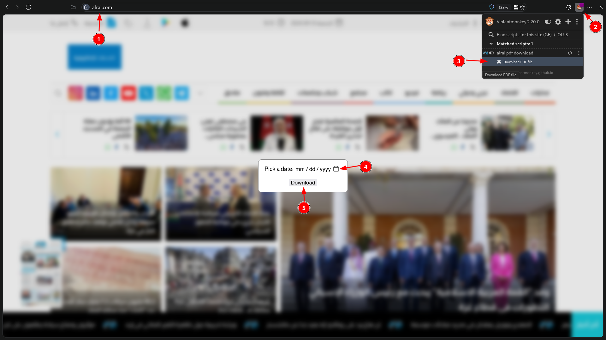

### install:
1. add [a userscript manager](https://violentmonkey.github.io/) to your browser.
1. open [this link](https://raw.githubusercontent.com/3m4r5/3m4r5/main/scripts/alrai_pdf/alrai_pdf.user.js) and install the script.
### How to use:

1. go to https://alrai.com/
1. open the script manager.
1. click on "Download PDF file".
1. pick a date.
1. click on "Download".